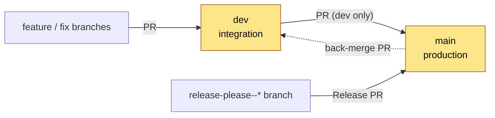
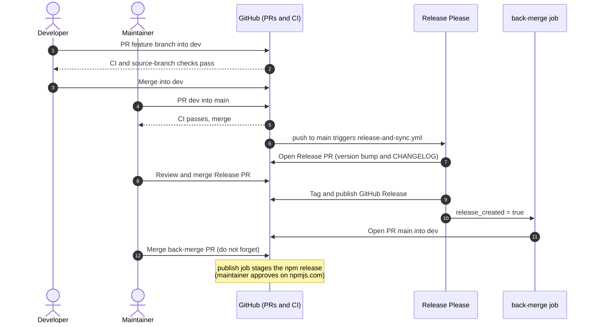
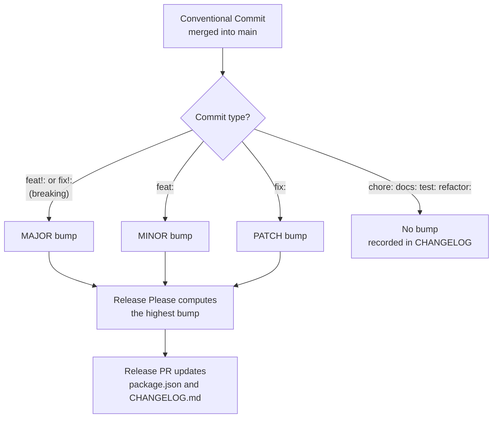
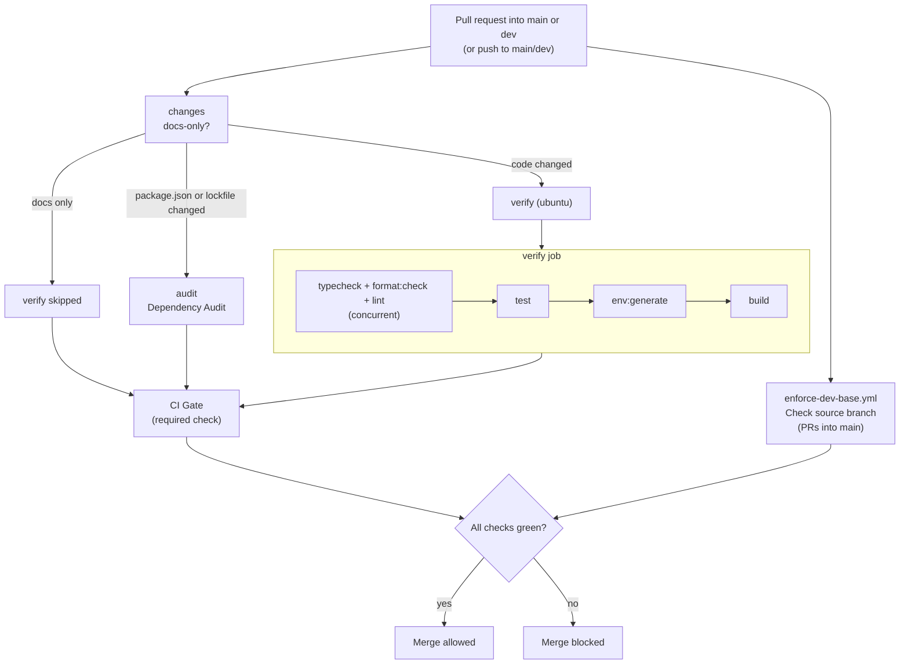
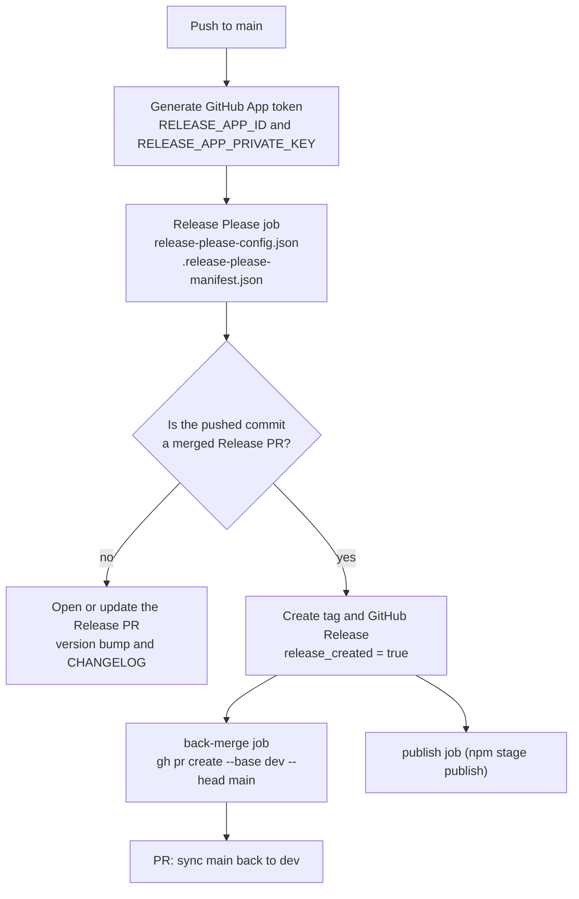
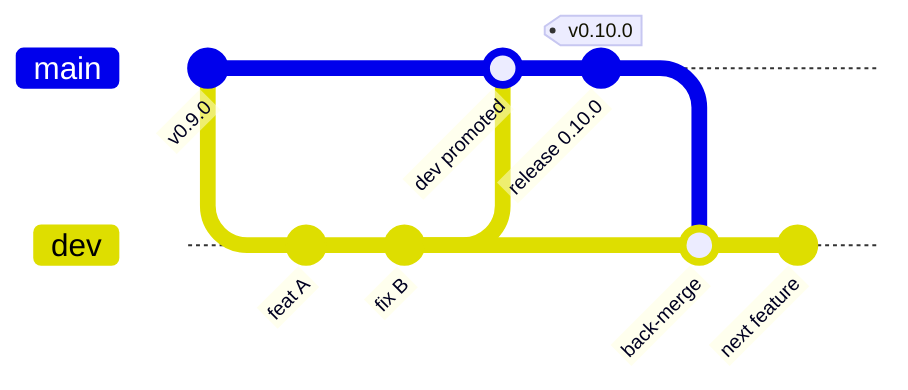
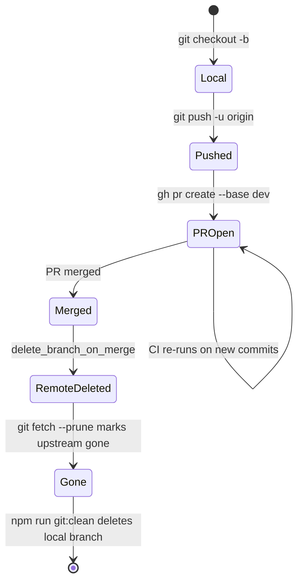
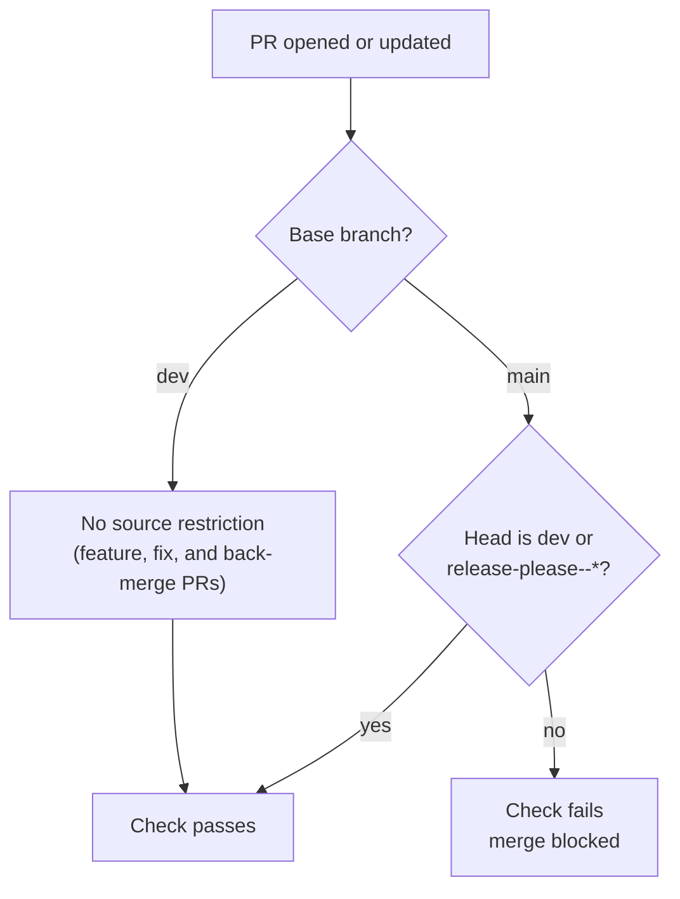
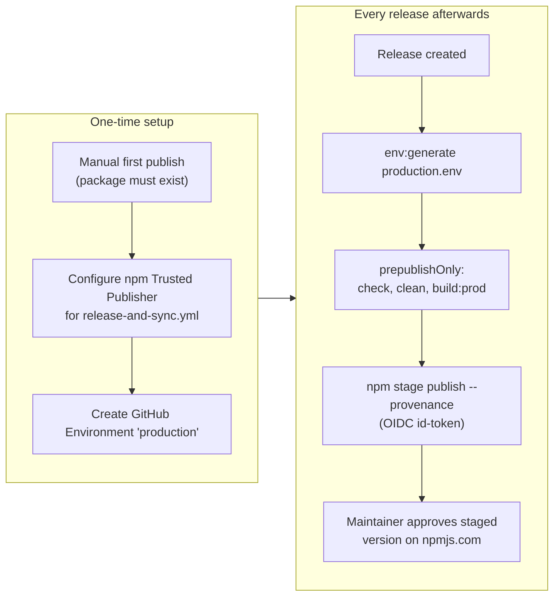

# Release Process

This project uses a GitFlow-inspired branching strategy combined with automated releases.

- `main` is the production branch. It contains only released code.
- `dev` is the active development branch — all feature/fix work is PR'd into it.
- `main` accepts PRs **only from `dev`** (plus automated `release-please--*` release PRs).
- CI (`ci.yml`) guards every PR into `main` and `dev`, and every push to them — typecheck,
  format, lint, tests, and build are all blocking. A single `CI Gate` check summarises the result.
- Release automation (`release-and-sync.yml`) handles version bumps, changelog generation,
  GitHub releases, the back-merge to `dev`, and publishing to npm
  (`@udan/digital-assistant-sdk`, staged for maintainer approval).
- Source branches are enforced by `enforce-dev-base.yml` (`Check source branch`): `main` only
  accepts `dev` (or `release-please--*`).
- `main` and `dev` are protected by **repository rulesets** — every change must arrive via
  a PR (see [Branch Protection](#branch-protection-repository-rulesets)).
- Stale branches are pruned automatically by the local janitor, `npm run git:clean`
  (see [Branch Hygiene & Automated Cleanup](#branch-hygiene--automated-cleanup)).

### Branch Model at a Glance



`dev` and `main` (highlighted) are protected by rulesets; nothing is pushed to them directly.

> **One-time prerequisite:** set the repository **default branch to `main`** (it was previously
> `dev`). See [Repository Setup](#repository-setup) below.

## The Step-by-Step Release Process

1. **Develop:** All features and fixes are PR'd into `dev`.
2. **Promote to Main:** When ready to release, a maintainer opens a PR from `dev` to `main`
   and merges it after CI passes. (`main` accepts PRs only from `dev`.) Pre-release
   verification of environment builds uses the `build:qa` / `build:dev` scripts locally or in a
   host app; there is no `qa` branch.
3. **Release Please:** GitHub Actions automatically opens a new "Release PR" against `main`.
   This PR contains the version bump (in `package.json`) and the updated `CHANGELOG.md`.
4. **Publish GitHub Release:** The maintainer reviews and merges the Release PR. The GitHub
   Release is automatically published.
   > The `publish` job then uploads the release to npm as a **staged** version. A maintainer
   > approves it on npmjs.com (passkey/2FA) before it goes live. See
   > [npm Publishing](#npm-publishing).
5. **⚠️ THE BACK-MERGE (DO NOT FORGET):** Because Release Please updated the version and
   changelog directly on `main`, `main` is now exactly one commit ahead of `dev`.
   **You MUST immediately back-merge `main` into `dev`** or merge the automated PR from
   `main` to `dev` (created by the `back-merge` job). If this is skipped, the next release
   will result in severe Git merge conflicts on `package.json` and `CHANGELOG.md`.

### Release Lifecycle (End to End)



### Commit Messages and Version Bumps



> **Note on versioning:** Release Please determines the next version from your commit
> messages (Conventional Commits — see `AGENTS.md` § 11). To lock a version instead of
> bumping it (e.g. keep `1.0.x` instead of `1.1.0`), edit the Release PR title and
> `package.json` inside the PR before merging; Release Please respects the override.

## Gate Status

All gates are blocking in CI:

| Gate | Workflow job | Status |
|---|---|---|
| `npm run typecheck` | CI / `verify` | **Blocking** |
| `npm run format:check` | CI / `verify` | **Blocking** |
| `npm run lint` | CI / `verify` | **Blocking** (legacy debt reported as warnings) |
| `npm test` | CI / `verify` | **Blocking** |
| `npm run build` | CI / `verify` (after `env:generate`) | **Blocking** |
| `npm run security` | CI / `audit` (and weekly `security.yml`) | **Blocking** (production deps at `high`; `critical` anywhere) |

How CI keeps runs short without dropping gates:

- **Docs-only changes** (every changed file is `*.md`, `artefacts/**`, `LICENSE`, or
  `CHANGELOG.md`) skip `verify`. Skipping happens at job level, so `CI Gate` still reports.
- **`audit`** runs when `package.json` or `package-lock.json` change, on pushes to `main`, and
  weekly (`security.yml`). It reads the lockfile and needs no install.
- **Concurrency:** a newer push to a PR cancels that PR's in-flight run; pushes to `main`/`dev`
  are never cancelled.
- **Ubuntu only on PRs.** macOS and Windows run weekly in `cross-os.yml` (non-blocking).
- Typecheck, format check, and lint run concurrently; webpack and Jest caches are restored
  between runs.

The `lint` gate passes while reporting pre-existing `no-explicit-any`/unused-var/
`@ts-ignore` debt as warnings; formatting is enforced as an error. The `security`
gate enforces production dependencies at `high` (currently 0) plus `critical`
anywhere (currently 0); dev-only toolchain advisories (chiefly `braces`/`micromatch`,
which have no patched release) are reported but do not block.



## Repository Setup

One-time settings, applied via `gh api` (or the GitHub UI):

```bash
# Use 'main' as the default branch (it was previously 'dev').
gh api -X PATCH repos/Digital-Assistant/Digital-Assistant-SDK \
  -f default_branch=main

# Delete PR head branches automatically once merged.
gh api -X PATCH repos/Digital-Assistant/Digital-Assistant-SDK \
  -f delete_branch_on_merge=true
```

### Release App (CI on bot-opened PRs)

PRs opened with the default `GITHUB_TOKEN` don't trigger workflows, so required checks
never report on them. `release-and-sync.yml` therefore opens the Release PR and the
back-merge PR with a GitHub App installation token
(`actions/create-github-app-token`). One-time setup:

1. Create a GitHub App in the `Digital-Assistant` org (webhook disabled) with repository
   permissions **Contents: Read and write**, **Pull requests: Read and write**, and
   **Issues: Read and write** (Release Please manages the `autorelease` labels).
2. Install it on `Digital-Assistant-SDK` only.
3. Store the App ID as repository variable `RELEASE_APP_ID` and a generated private key
   as repository secret `RELEASE_APP_PRIVATE_KEY`.

Without these, the release workflow fails on `main`.

### Release Automation Workflow

How `release-and-sync.yml` reacts to a push to `main`:



The App token matters because PRs opened with the default `GITHUB_TOKEN` do not trigger
workflows, so required checks would never report on the Release PR or the back-merge PR.

### Why the Back-Merge Matters



Release Please commits the version bump and changelog directly on `main`. Without the
`main → dev` back-merge, the next release hits conflicts on `package.json` and `CHANGELOG.md`.

## Branch Protection (Repository Rulesets)

`main` and `dev` are protected by **repository rulesets** (the modern successor to
classic branch protection). Configured with no bypass actors, direct pushes, force-pushes, and
branch deletion are blocked for everyone, including maintainers.

| Ruleset | Targets | Rules |
|---|---|---|
| `Protect main branch` | `refs/heads/main` | require PR, block deletion, block force-push, require status checks (`Check source branch`, `CI Gate`) |
| `Protect dev branch` | `refs/heads/dev` | require PR, block deletion, block force-push, require status checks (`CI Gate`) |

`CI Gate` is the single aggregate check emitted by `ci.yml`. It passes only when the
`verify` and `audit` jobs each succeeded or were intentionally skipped (docs-only change, or no
dependency change), so job renames or additions never require a ruleset edit.

Consequences:

- **Every change to `main` or `dev` must arrive via a pull request.** `required_approving_review_count`
  is `0`, so a PR is required but a human approval is not.
- **Source-branch restrictions** are enforced by the `Check source branch` status (emitted by
  `.github/workflows/enforce-dev-base.yml`): `main` only accepts `dev`
  or `release-please--*`. Rulesets cannot express source-branch rules themselves.
- Merges must pass CI: the `CI Gate` check, which aggregates `verify` (typecheck, format, lint,
  tests, build on `ubuntu-latest`) and the dependency `audit` (all gates block). macOS and
  Windows are exercised by the weekly, non-blocking `cross-os.yml` workflow.
- `strict_required_status_checks_policy` is `false` — a PR branch does not need to be up to
  date with the base branch before merging.

> These rules are the enforcement behind the convention "never commit directly to `main` or `dev`" (`AGENTS.md` § 11). They are configured on GitHub
> (**Settings → Rules → Rulesets**), not in repository files. Example creation via `gh api`:
>
> ```bash
> gh api -X POST repos/Digital-Assistant/Digital-Assistant-SDK/rulesets \
>   --input protect-main.ruleset.json
> ```
>
> where `protect-main.ruleset.json` includes `target` `branch`, the `refs/heads/main`
> include pattern, and the desired `rules` (pull request, deletion, non-fast-forward,
> required status checks).

## Branch Hygiene & Automated Cleanup

Feature, release, and back-merge PRs leave head branches behind after merge. This section
keeps local and remote branches at the clean state (`main`, `dev`).

### 1. Delete remote head branches automatically (one-time GitHub setting)

Enable **"Automatically delete head branches"** in
`Settings → General → Pull Requests`, or set it via the API:

```bash
gh api -X PATCH repos/Digital-Assistant/Digital-Assistant-SDK \
  -f delete_branch_on_merge=true
```

GitHub then deletes a PR's head branch the moment it is merged. Release Please PRs
(`release-please--...`) are covered by this; the back-merge PR uses `main` as its head, so it
creates no transient branch to delete (`main` is never deleted — it is the default branch).

### 2. Prune remote-tracking references locally

```bash
git config --global fetch.prune true   # or drop --global for this repo only
```

Every `git fetch`/`git pull` then marks deleted remotes as `[gone]` instead of leaving
stale `origin/<branch>` pointers.

### 3. Delete stale local branches (`npm run git:clean`)

The janitor (`scripts/git-branch-janitor.mjs`) is a cross-platform Node ESM script — no build
step required. It deletes local branches whose upstream is gone, without touching `main`,
`dev`, or the current branch.

```bash
npm run git:clean:dry   # dry run — list what would be deleted (safe default)
npm run git:clean       # delete stale branches
```

Options: pass `--protected=main,dev,release` to override the protected allowlist.

> **Why `-D` and not `-d`:** squash-merges make `git branch -d` refuse to delete a branch
> (it cannot see the merge), so the janitor force-deletes. It only targets branches whose
> upstream is already gone; a purely local branch with no upstream is never touched.

### Branch Lifecycle



### 4. Keep `main` synced locally

```bash
git fetch origin main:main   # fast-forward local main without checkout (refuses non-FF)
```

If `main` is currently checked out, use `git pull --ff-only` instead.

### Recovery

If a branch was deleted by mistake, restore it from the reflog:

```bash
git reflog --all | grep <branch-name>
git branch <branch-name> <recovered-sha>
```

### Source-Branch Enforcement

`enforce-dev-base.yml` emits the `Check source branch` status, which rulesets cannot express on their own:



## npm Publishing

The package is published to npm as **`@udan/digital-assistant-sdk`** (npm org `udan`,
`--access public`) by the `publish` job in `release-and-sync.yml`, whenever a Release PR is
merged into `main`.

**How it works:**

- **Trusted Publishing** (GitHub OIDC, no stored token): on npmjs.com the package's
  **Settings → Trusted Publisher** allows owner `Digital-Assistant`, repository
  `Digital-Assistant-SDK`, workflow `release-and-sync.yml`, environment `production`.
  Publishing access is set to require 2FA and disallow tokens.
- The job runs in the GitHub Environment `production`, checks out the release tag, generates
  `environments/production.env`, and runs `npm stage publish --provenance --access public`
  (npm >= 11.21). The trusted publisher allows staged publishes only; a plain `npm publish`
  from CI fails with `403 OIDC permission denied for this action`.
  `prepublishOnly` runs `check`, `clean`, and `build:prod` (production mode, minified).
- **Build-time keys are intentionally empty.** Host applications pass configuration at
  runtime, so nothing secret is inlined into the public bundle.
- **Staged publishing:** the upload lands as a staged version. Approve it on npmjs.com
  (package page → staged versions) with your passkey/2FA, or from a terminal with
  `npm stage list @udan/digital-assistant-sdk` and `npm stage approve <stage-id>`. Only then
  does it become `latest`.
- The domjson patch runs from the `prepare` script, so consumer installs don't run it, and
  `tsconfig.build.json` keeps test files out of the emitted declarations.

**Package setup history:** `0.0.0-placeholder` was published by hand so that the trusted
publisher could be configured (npm requires the package to exist first). If the trusted
publisher configuration lapses or the repo/workflow/environment changes, update it on the
package's settings page; all four fields must match exactly.



## Future Plans

**Move to trunk-based development.** The `qa` branch was retired because it ran the same CI as
`dev` and added no verification of its own, so the flow is now `feature → dev → main`. The next
step is to remove `dev` as well and move to trunk-based development:

- Short-lived feature branches are PR'd straight into `main`; `main` is always releasable.
- Incomplete work ships behind feature flags (for example `enableRecording`,
  `enableSlowReplay`) or lands in small additive pieces.
- Release Please keeps producing the Release PR from Conventional Commits; the staged npm
  publish remains the final human gate.
- Pre-release verification moves from a branch to an artifact: prereleases published to the
  npm `next` dist-tag, while consumers stay on `latest`.
- A GitHub merge queue (`merge_group` trigger) tests the real merge result, replacing the
  post-merge push runs.
- The `dev → main` promotion PRs, the `main → dev` back-merge job, and the source-branch check
  are no longer needed.

Why: every change currently passes the same gates several times (feature PR, `dev` push,
promotion PR, `main` push), and long-lived branches drift. Trunk-based development runs the
gates once per change and removes the back-merge risk described above.

## Security Note

- **Committed credentials must be rotated.** `environments/local.env` was previously tracked
  and remains in git history; untracking does not remove the values. Rotate
  `keycloakClientSecret`, `profanityKey`, `googleTranslateApiKey`, and
  `googleAnalyticsSecretKey` (and any other exposed keys) regardless of the untracking.
- **Secrets must not be baked into the browser bundle.** `webpack.config.js` uses
  `dotenv-webpack`, which inlines every `process.env.*` referenced in `src/` into the
  client-side bundle. Treat all `environments/*.env` values as public. The long-term fix
  (move secret-bearing config to runtime host-provided config) is a tracked follow-up.
